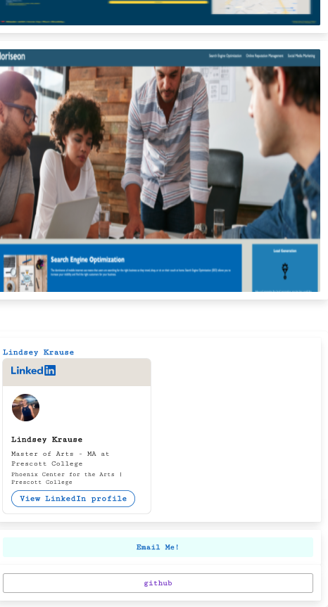

# read-me-generator

 #  Recipe Discovery
  

  
  
  
  

## Description 

I built this project to discover new recipes and add the contents to a list that shows me what grocery store near me offers the best price for the bulk of the items. It also creates a recipe in my fitness pall and records the macros to it.  I'm a meal planning fanatic and I need this in my life. 

## Table of Contents
- [Installation](#installation)
- [Usage](#usage)
- [Credits](#credits)
- [License](#license)
- [Contributing](#Contributing)
- [Tests](#tests)
- [Questions](#questions)

## Installation
Download and install the application and use the init function in node to run the application

## Usage
Pick your favorite recipe from the internet and enter the url to the app.  Pick the grocery stores you would like to include and link your my fitness pal app. Hint: if you click the grocery store the app returns, it will take you to a map/directions on iphone using maps. 

## Credits
I didn't have any collaborators. 
my fitness pal, maps, etc.
example

## License

  
  
  
  
This is just an example and does not have the licensing shown.

## Contributing
this is an example

## Tests
this is also an example of tests I believe

## Questions
If you have any questions or need additional information, you can reach me at the following places:
### Github
example
https://lindseykrause.github.io/Lindsey-Krause-Portfolio/
### Email
scarrlettearianne@gmail.com
 
